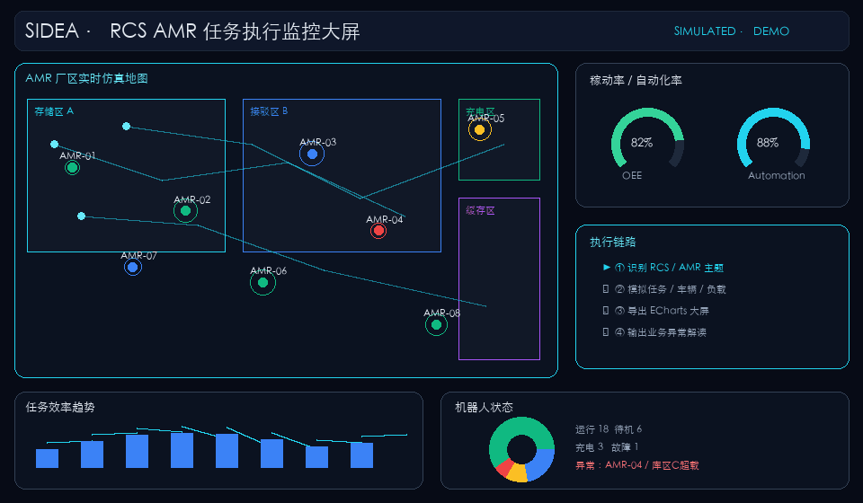
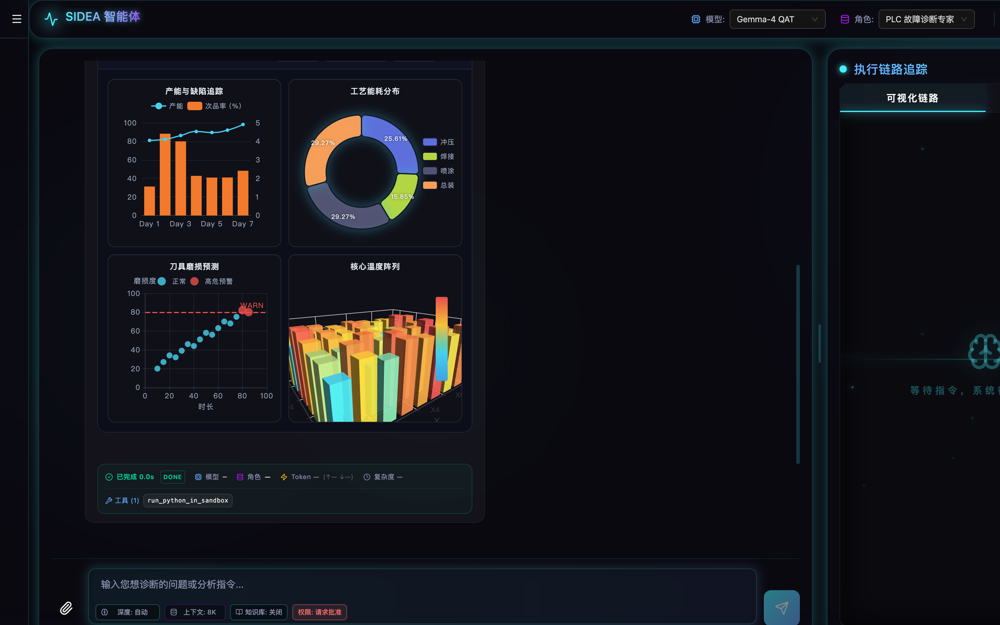
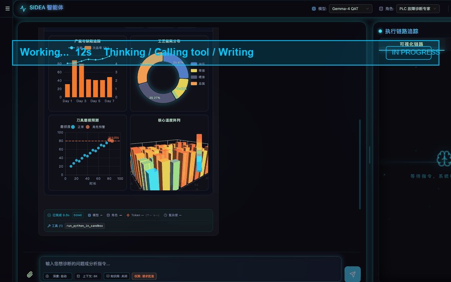
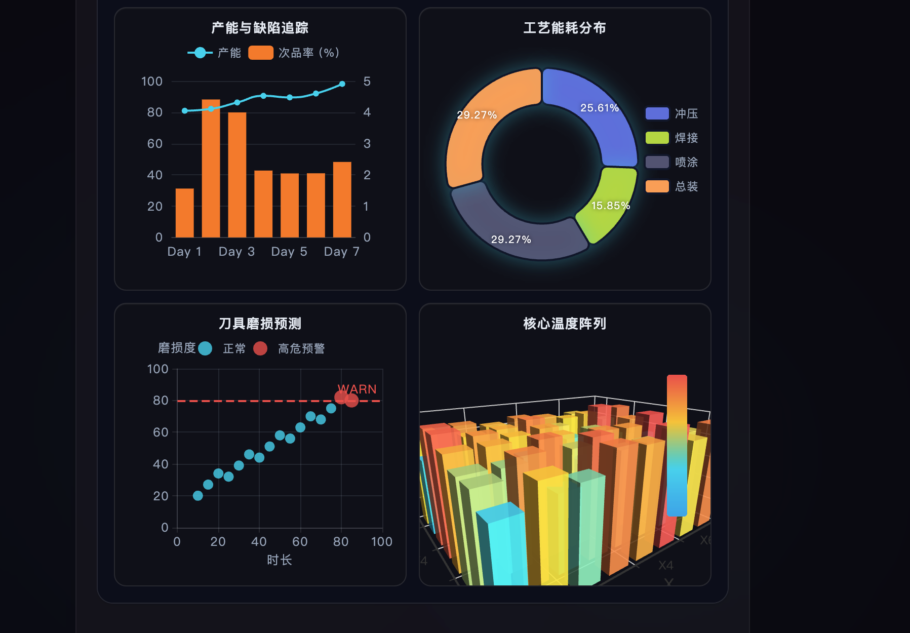
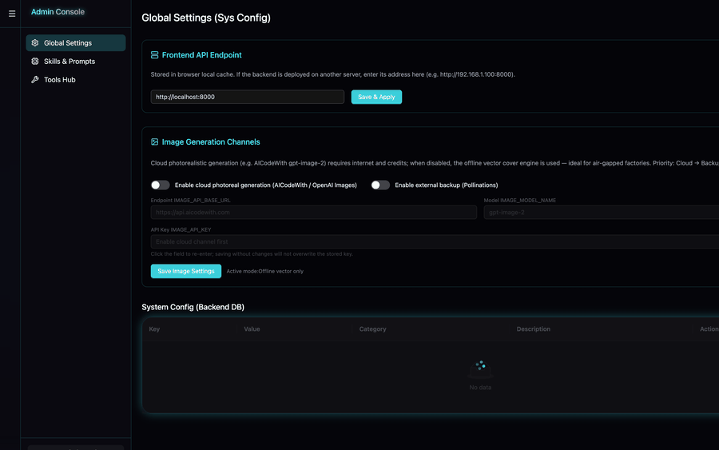

<div align="center">

# SIDEA Agent

### 面向 RCS / AMR 与工业现场的开源 AI Agent 工作台

用自然语言连接工业系统、执行诊断任务，并生成带 3D、动画和业务解读的数字孪生大屏。

[](https://github.com/nanfengovo/SIDEA-Agent/actions)
[](LICENSE)
[](https://github.com/nanfengovo/SIDEA-Agent/stargazers)
[](https://www.python.org/)
[](https://react.dev/)
[](https://github.com/langchain-ai/langgraph)
[](https://fastapi.tiangolo.com/)

[快速开始](#-快速开始) · [Docker](#-docker-一键启动) · [离线 Demo](#-离线-amr-demo) · [RCS 接入](#-可配置-rcs-适配层) · [贡献](#-参与贡献)

</div>

<p align="center">
  
</p>

> SIDEA（System for Industrial Diagnostics & Efficiency Analysis）不是通用聊天壳。它把 **LLM、工业接口、工具执行、可追踪任务链和可交互大屏** 组合成一套可本地部署的工业智能体工作台。

## ✨ 为什么是 SIDEA

| 能力 | SIDEA 的做法 |
| --- | --- |
| **工业系统接入** | 用 Profile + Operation Binding 将不同 RCS / AMR HTTP API 映射为稳定语义能力，无需为每个项目重写 Agent |
| **多模型统一管理** | 在管理后台配置 Ollama、OpenAI、Gemini 和 OpenAI-compatible 中转站，测试并一键切换 Active Profile |
| **模型分级出图** | 小模型走稳定模板；商业/强模型自由生成完整 ECharts，自动校验并在失败时回退 |
| **数字孪生大屏** | AMR 厂区仿真地图、动态路径、车辆状态、3D 负载、OEE、自动化率、任务效率 |
| **执行过程可见** | SSE 流式输出，完整展示思考、工具调用、耗时、Token、成功/失败和最终总结 |
| **本地与离线友好** | 支持 Ollama、本地 RAG、SQLite、离线矢量封面；适合隔离网络和工厂内网 |
| **可运营的工作台** | 会话文件夹、多语言 UI、技能与 Prompt 管理、连接器管理、历史度量和 ETA 预估 |

## 🖥️ 产品预览

### Agent 工作台：对话、执行链路与可追踪结果



<p align="center">
  
</p>

### 工业数字孪生大屏

Agent 可把业务需求和 RCS 数据转换为交互式 Dashboard，并支持全屏、新标签页、主题切换以及 JSON / 图片 / PDF 导出。



### 管理后台：不用改代码切换模型和能力

<p align="center">
  
</p>

管理后台包含：

- LLM Provider Profile：Ollama / OpenAI / Gemini / 第三方中转
- RCS Connector Profile：地址、鉴权、超时、模拟模式、启用状态
- Operation Binding：请求模板、字段映射、响应映射和成功条件
- Skills / Prompts / Tools：技能、系统提示词和工具注册总览
- 全局配置：API、图像生成和系统运行参数

## 🚀 快速开始

### 环境要求

- Python 3.10+
- Node.js 18+
- 一个可用模型：本地 [Ollama](https://ollama.com/) 或 OpenAI / Gemini / OpenAI-compatible API

### 1. 克隆并安装

```bash
git clone https://github.com/nanfengovo/SIDEA-Agent.git
cd SIDEA-Agent

python -m venv .venv
source .venv/bin/activate          # Windows: .venv\Scripts\activate
pip install -r requirements.txt

cd frontend
npm install
cd ..
```

### 2. 启动

打开两个终端：

```bash
# Terminal 1 — API
python main.py
```

```bash
# Terminal 2 — Web
cd frontend
npm run dev
```

访问：

- Web：<http://localhost:5173>
- API 文档：<http://localhost:8000/docs>
- Health：<http://localhost:8000/health>

也可以在依赖安装完成后运行：

```bash
chmod +x start.sh
./start.sh
```

### 3. 配置第一个模型

1. 打开右上角 **管理后台**
2. 进入 **模型连接器**
3. 新建 Ollama、OpenAI、Gemini 或 OpenAI-compatible Profile
4. 点击 **测试连接**
5. 将可用 Profile 设为 **Active**

> API Key 当前存储在本机 SQLite。公开部署前请接入 Secret Manager 或环境变量，并启用鉴权。

## 🐳 Docker 一键启动

```bash
cp .env.example .env
docker compose up --build
```

访问：

- Web：<http://localhost:8080>
- API：<http://localhost:8000>
- Health：<http://localhost:8000/health>

关键环境变量见 [`.env.example`](.env.example)：

| 变量 | 说明 | 默认 |
| --- | --- | --- |
| `PUBLIC_BASE_URL` | 生成图表/图片 Markdown 链接的公网 Origin | `http://localhost:8000` |
| `VITE_BASE_URL` | 前端构建期 API Origin | `http://localhost:8000` |
| `CORS_ORIGINS` | 允许的前端 Origin 列表 | `http://localhost:8080,...` |
| `AUTH_JWT_SECRET` | JWT 密钥（生产必须改） | 示例弱密钥 |
| `WEB_PORT` / `API_PORT` | 宿主机映射端口 | `8080` / `8000` |

## 🧪 离线 AMR Demo

不依赖 LLM、不依赖真实 RCS，也能生成确定性大屏：

```bash
python scripts/demo_amr.py
# → sandbox_workspace/demo_amr_dashboard.json
```

然后在聊天中粘贴：

````md
```echarts-i18n
http://localhost:8000/sandbox_workspace/demo_amr_dashboard.json
```
````

或直接打开已启动的 Web，让 Agent 使用 README 中的示例 Prompt。

运行测试：

```bash
pytest -q
cd frontend && npm run lint && npm run build
```

## 🤖 模型能力分级

同一个 Prompt 用 2B 本地模型和商业模型得到几乎相同的结果，通常不是模型能力相同，而是系统把它们限制在了同一套模板里。SIDEA 会根据 Active Profile 自动选择生成路径：

```text
Local small model
    └─ Template tier → 固定面板协议 → 稳定 ECharts

OpenAI / Gemini / compatible / large local model
    └─ Freeform tier → 完整 ECharts JSON → 校验与修复 → 模板回退
```

- **Template tier**：适合小模型，结果稳定、结构可控
- **Freeform tier**：适合强模型，可生成英雄面板、3D、动画和更自由的布局
- 可在 LLM Profile 中手动覆盖 `dashboard_tier`
- 空数据或不可渲染面板会被拒绝；AMR 主题缺少地图时会自动注入仿真地图兜底

## 🔌 可配置 RCS 适配层

SIDEA 将 Agent 使用的稳定语义能力与现场项目的具体 API 解耦：

```text
Agent / Skill
    │
    ├─ task.list
    ├─ task.stats
    ├─ agv.status
    ├─ alarm.list
    ├─ map.snapshot
    └─ plc.read
          │
          ▼
Semantic Tool Registry
          │
          ▼
Connector Profile + Operation Binding
          │
          ▼
Customer RCS / WMS / PLC HTTP API
```

每个 Binding 可独立配置：

- HTTP method 与 path
- Query / Header / Body 模板
- 输入字段映射
- JSON 响应路径映射
- 成功条件、超时和风险级别
- 真数据优先、失败自动使用模拟数据

这使同一套 Agent 能在不同客户、不同 RCS 项目之间复用，而不是把接口地址和字段写死在 Prompt 或工具代码中。

## 🧭 一次大屏任务如何执行

```text
用户需求 / 参考图
        │
        ▼
Goal Orchestrator
        │
        ├─ 识别工业主题与模型能力档
        ├─ 调用 RCS 语义工具获取真数据
        ├─ 无可用连接时构造带异常点的模拟数据
        ├─ 生成并校验 Dashboard JSON
        ├─ 导出交互式 ECharts 大屏
        └─ 基于面板数据生成业务解读
```

示例 Prompt：

> 以“RCS AMR 任务执行监控”为主题生成数字孪生大屏：中央展示厂区仿真地图，包含存储区、充电区、接驳区和 10 台 AMR；车辆按忙碌、空闲、充电、故障着色，并展示动态任务路径。补充 3D 库区负载、稼动率、自动化率、任务效率和机器人状态。数据自行模拟，加入一台故障车和一个超载库区。

## 🧩 架构

```text
┌──────────────────────────────── React 19 Web ────────────────────────────────┐
│ Chat · Activity Timeline · Dashboard · History · Admin · i18n              │
└───────────────────────────────┬──────────────────────────────────────────────┘
                                │ REST / SSE
┌───────────────────────────────▼──────────────────────────────────────────────┐
│ FastAPI · LangGraph Agent · Goal Pipeline · Skill Registry                  │
├──────────────────┬───────────────────────┬───────────────────────────────────┤
│ LLM Factory      │ Semantic RCS Tools    │ Sandbox / ECharts / Image Tools   │
│ Ollama/OpenAI/   │ HTTP Adapter          │                                   │
│ Gemini/Relay     │ Profile + Binding     │                                   │
├──────────────────┴───────────────────────┴───────────────────────────────────┤
│ SQLite: config · profiles · sessions · messages · metrics                  │
└──────────────────────────────────────────────────────────────────────────────┘
```

主要技术栈：FastAPI、LangGraph、LangChain、SQLite、React、TypeScript、Vite、Tailwind CSS、Framer Motion、ECharts / ECharts GL。

## 🧰 内置能力

- **Agent**：ReAct、流式响应、Tool Calling、HITL 权限模式
- **数据**：Python 沙箱、Excel / PDF / Word 读取、图表导出
- **RAG**：ChromaDB + Sentence Transformers，可选本地知识增强
- **工业工具**：PLC 读取、任务统计、告警、AGV 状态、地图快照
- **图像**：云端生成、备用服务、离线程序化封面
- **国际化**：简体中文、繁体中文、English、日本語
- **导出**：Dashboard JSON、图片、PDF、Prompt 与数据

## 📁 项目结构

```text
SIDEA-Agent/
├── agent/                    # LangGraph 与 Goal Pipeline
├── api/routes/               # Chat、History、Admin、RCS、LLM API
├── core/                     # LLM Factory、Public URL
├── integrations/
│   ├── llm/                  # Provider Profile、模型目录、能力分级
│   └── rcs/                  # Connector、Binding、HTTP Adapter、语义工具
├── tools/                    # Sandbox、Chart、Image、PLC
├── skills/templates/         # 工业角色与系统 Prompt
├── scripts/                  # demo_amr.py 等离线脚本
├── tests/                    # pytest smoke tests
├── docker/                   # entrypoint、nginx
├── frontend/                 # React Web
├── sandbox_workspace/        # Agent 生成的图表和图片
└── docs/screenshots/         # README 演示素材
```

## 🗺️ 路线图

- [x] LangGraph Agent 与流式执行时间线
- [x] 多 Provider LLM Profile 与动态模型列表
- [x] 可配置 RCS Connector / Operation Binding
- [x] 强弱模型分级的大屏生成流水线
- [x] AMR 地图、动态路径与 ECharts GL
- [x] 会话文件夹与历史管理
- [x] Docker Compose 一键部署
- [x] 可复现离线 AMR Demo + CI smoke tests
- [ ] RCS Connector 模板市场
- [ ] Three.js / glTF 真正 3D 厂区数字孪生
- [ ] RBAC、审计日志与 Secret Manager
- [ ] 更完整的端到端浏览器测试

## 🤝 参与贡献

这是一个早期项目，最需要的不是“万能功能”，而是真实工业场景反馈。

请先阅读 [`CONTRIBUTING.md`](CONTRIBUTING.md)。欢迎通过 [Issues](https://github.com/nanfengovo/SIDEA-Agent/issues) 提交：

- 你的 RCS / AMR 接口结构和适配需求
- 大屏模板、工业 Skill 或 Prompt
- Bug、可用性问题和部署反馈
- 文档、测试、国际化和 Connector 贡献

如果这个方向对你有帮助，请给项目一个 ⭐。Star 能让更多做 RCS、AMR、WMS 和工业 AI 的开发者发现它。

## 🔐 生产使用提醒

当前仓库定位是可运行的工程原型。用于生产前请至少完成：

- 配置 API 鉴权与 RBAC
- 将 API Key 从 SQLite 迁移到 Secret Manager
- 收敛工具权限和沙箱文件访问范围
- 为写操作增加人工确认、审计和幂等机制
- 根据工厂网络策略禁用不需要的外网通道
- 修改 `AUTH_JWT_SECRET`，并收紧 `CORS_ORIGINS`

## License

MIT License. See [`LICENSE`](LICENSE).

---

## English

**SIDEA Agent** is a self-hostable AI agent workspace for RCS, AMR, and industrial operations. It connects configurable industrial HTTP APIs to stable semantic tools, supports Ollama / OpenAI / Gemini / compatible providers, traces every tool call, and turns operational requirements into interactive ECharts dashboards.

```bash
cp .env.example .env
docker compose up --build
# or
python scripts/demo_amr.py
```

See [Quick Start](#-快速开始), [Docker](#-docker-一键启动), and [Offline Demo](#-离线-amr-demo) above.
