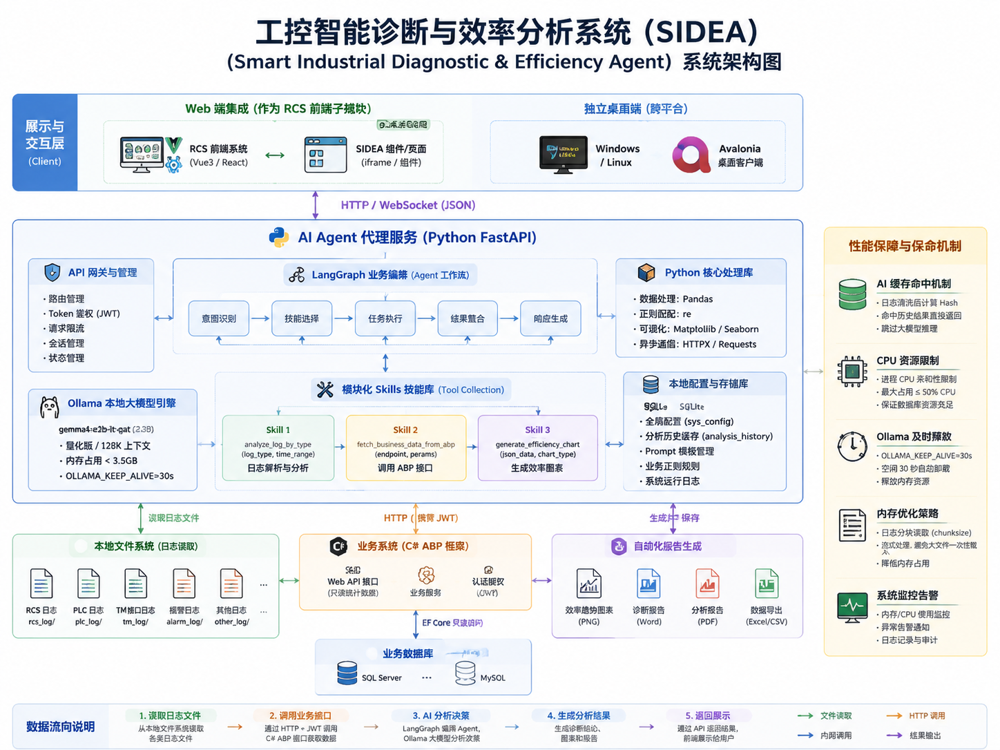
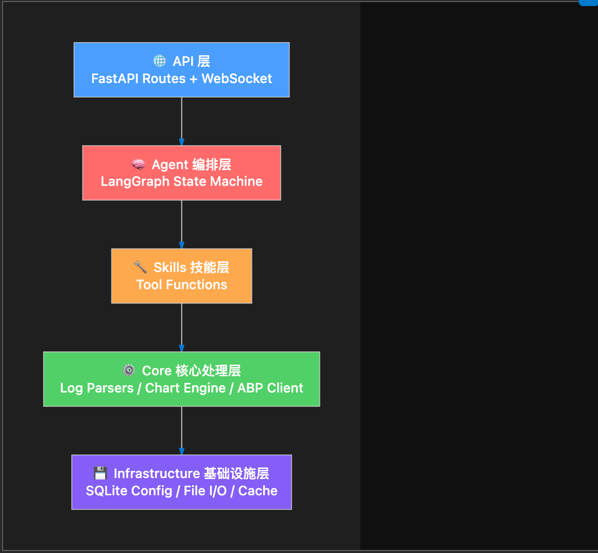

# 🏭 工控智能诊断与效率分析系统 (SIDEA) 
**（Smart Industrial Diagnostic & Efficiency Agent）**
**—— 需求说明与系统架构设计文档 v1.0**

## 1. 产品概述
**1.1 系统背景**
当前工控现场环境中，包含 RCS（机器人控制系统）、PLC、TM、MES 及各类第三方接口，日志种类繁多且数据量巨大。运维人员在排查故障、分析自动化效率时，依赖人工拉取日志和数据库进行分析，耗时且门槛高。
在目标服务器资源极度受限（16GB内存、无显卡、并存有现有业务系统）的前提下，急需一套轻量级、智能化的辅助诊断与图表生成工具。

**1.2 系统定位**
本系统（SIDEA）是一个基于本地轻量级大模型（SLM）和 Agent 技术构建的**离线自动化诊断专家**。它通过“旁路分析”模式运行，不对现有业务系统产生直接压力，支持作为现有 RCS 系统的 Web 组件运行，亦支持未来通过独立桌面端（Avalonia）跨平台部署。

---

## 2. 核心业务需求

1.  **多源异构日志诊断**：自动读取并解析固定文件夹下分类存储的日志（如 RCS 日志、PLC 日志、TM 接口日志、报警日志等），提炼异常信息并由 AI 给出排查建议。
2.  **自动化效率分析与可视化**：根据日志或通过接口获取的业务数据，自动进行数据聚合，并离线渲染效率趋势图表（折线图、柱状图等）。
3.  **Agent 智能调度 (Skills)**：AI 具备意图识别能力，能够根据用户的自然语言提问（如“今天上午 PLC 为啥停机了？”），自主选择调用哪个日志解析器或哪个数据接口。
4.  **高度配置化**：系统的核心运行参数（文件路径、正则规则、大模型参数、C# 接口地址等）必须实现全面外置配置化，避免硬编码。
5.  **严格的资源管控**：保证在 16GB 无显卡环境下运行，不能影响现有的 TM 系统及 SQL Server/MySQL 数据库的正常运转。

---

## 3. 多系统交互与架构设计



系统采用**“前后端分离 + 旁路 AI 辅助”**的架构，严格遵守“Python 不直连业务数据库，通过 C# ABP 获取数据”的原则。

### 3.1 总体架构图 (逻辑视图)
```text
┌────────────────────────────────────────────────────────────────────────┐
│                          展示与交互层 (Client)                         │
│  ├─ Web 端集成：作为 RCS 前端 (Vue3/React) 的一个子模块 iframe/组件    │
│  └─ 独立桌面端：基于 Avalonia (C#) 构建的跨平台客户端 (Windows/Linux)  │
└───────────────────────────────────┬────────────────────────────────────┘
                                    │ HTTP / WebSocket (JSON)
                                    ▼
┌────────────────────────────────────────────────────────────────────────┐
│                       AI Agent 代理服务 (Python FastAPI)               │
│  ┌────────────────┐  ┌─────────────────────┐  ┌─────────────────────┐  │
│  │  API 网关路由  │  │ LangGraph 业务编排  │  │ Python 核心处理库   │  │
│  │ (鉴权/状态管理)│  │ (Agent 工作流/决策) │  │ (Pandas/Matplotlib) │  │
│  └───────┬────────┘  └──────────┬──────────┘  └──────────┬──────────┘  │
│          │调用                  │ 触发(Tool Calling)     │ 解析        │
│  ┌───────▼────────┐  ┌──────────▼──────────┐  ┌──────────▼──────────┐  │
│  │ Ollama 引擎    │  │ 模块化 Skills 技能库│  │ 本地配置与存储库    │  │
│  │ (gemma4 2.3B)  │  │ (日志分析/接口调用) │  │ (SQLite)            │  │
│  └────────────────┘  └──────────┬──────────┘  └─────────────────────┘  │
└─────────────────────────────────│──────────────────────────────────────┘
      ┌───────────────────────────┼───────────────────────────┐
      │ 读取本地文件夹            │ HTTP (携带 JWT)           │ 
      ▼                           ▼                           ▼
┌─────────────┐       ┌────────────────────────┐      ┌───────────────┐
│ 各类日志文件│       │ 业务系统 (C# ABP 框架) │      │ 自动化报告生成│
│ (PLC/RCS等) │       │ (提供统计与基础信息API)│      │ (Word/PDF/PNG)│
└─────────────┘       └───────────┬────────────┘      └───────────────┘
                                  │ EF Core
                      ┌───────────▼────────────┐
                      │ 业务数据库 (SQL Server/│
                      │ MySQL)                 │
                      └────────────────────────┘
```

---

## 4. 技术栈选型清单

| 层次 | 技术选型 | 版本/说明 | 选型依据与资源限制考量 |
| :--- | :--- | :--- | :--- |
| **客户端/UI** | Vue3/React (集成)<br>Avalonia (独立) | 最新稳定版 | 复用现有系统；Avalonia 支持 C# 跨平台开发且打包体积适中。 |
| **Agent 后端** | FastAPI (Python) | 0.100+ | 异步非阻塞，轻量级 API 网关。 |
| **编排与框架** | LangChain & LangGraph | 核心精简版 | LangGraph 提供有向无环图控制，防止 AI 死循环耗尽 CPU。 |
| **本地大模型** | Ollama + `gemma4:e2b-it-qat` | 量化感知版 (2.3B) | **强制约束**：运行内存占用须 < 3.5GB，支持 128K 极长上下文。 |
| **数据清洗** | Pandas, re (正则) | 内存优化模式 | 采用 `chunksize` 分批读取，拒绝将 GB 级日志一次性读入内存。 |
| **图表可视化** | Matplotlib, Seaborn | 无需交互模式 | 后台静默生成图片（`.png`），占用内存极低，不依赖浏览器渲染。 |
| **配置与持久化**| SQLite | Python内置 | 零依赖、免安装。存储配置、Prompt 及历史诊断缓存。 |
| **外部通信** | Requests, HTTPX | - | 用于 Python 与 C# ABP 框架进行安全的数据交互。 |

---

## 5. 核心功能模块详细设计

### 5.1 全局动态配置中心 (SQLite)
“能配置的全部配置”，通过 Python `sqlite3` 或 `SQLAlchemy` 管理。
**配置表单（`sys_config`）需包含但不限于：**
1.  **路径配置**：
    *   `PATH_LOG_RCS`：RCS日志绝对路径
    *   `PATH_LOG_PLC`：PLC日志绝对路径
    *   `PATH_OUTPUT_REPORT`：生成的分析报告和图表保存路径
2.  **模型参数配置**：
    *   `LLM_MODEL_NAME`：默认为 `gemma4:e2b-it-qat`
    *   `LLM_MAX_TOKENS`：限制最大输出长度（防卡顿）
    *   `LLM_TEMPERATURE`：分析日志时设为 0.1（保证严谨），写周报时设为 0.7
3.  **外部接口配置**：
    *   `API_ABP_BASE_URL`：C# 业务系统基础路由（如 `http://localhost:5000`）
    *   `API_AUTH_TYPE`：认证方式（Token）
4.  **业务正则规则（高级配置）**：
    *   将常用异常日志的正则表达式也存于数据库，例如 `REGEX_PLC_ERROR`，允许实施人员根据不同现场修改提取规则，而无需修改 Python 源码。

### 5.2 模块化日志清洗与解析 (Log Parsers)
采用工厂模式或策略模式。对于每一个固定的日志文件夹，配备独立的 Parser。
*   **规则 1 (正则提取)**：读取日志文本，通过预设的正则表达式，仅提取包含 `Error`, `Timeout`, `Warning`, `Offline` 等关键词的行。
*   **规则 2 (时序聚合)**：利用 Pandas 对提取的异常行进行聚合（如 `groupby('error_code').size()`），计算特定异常在一小时内发生的**频次**、**首次发生时间**和**末次发生时间**。
*   **规则 3 (格式压缩)**：将聚合后的数据转换为极简 Markdown 表格格式，交由 LLM 处理。

### 5.3 Agent Skill 技能库设计 (Tools)
将具体动作封装为带有强类型描述的 Tool，供 `gemma4` 进行 Function Calling 决策。
*   **Skill 1: `analyze_log_by_type(log_type, time_range)`** -> 触发具体的 Log Parser。
*   **Skill 2: `fetch_business_data_from_abp(endpoint, params)`** -> 发起 HTTP 请求到 C# ABP 后端拉取业务统计数据（如每日订单完成率、AGV 利用率）。
*   **Skill 3: `generate_efficiency_chart(json_data, chart_type)`** -> 接收 LLM 生成的 JSON 数据格式，调用 Matplotlib 渲染图表并保存到本地。

### 5.4 性能防崩溃与系统保命机制
1.  **AI 缓存命中 (History Cache)**：每次生成诊断前，对“清洗后的日志数据”计算 Hash。若 Hash 值在 SQLite `analysis_history` 表中存在（即相同的报错），直接返回历史分析结果，**跳过大模型推理**，节省 CPU。
2.  **强制资源分配 (Affinity)**：系统启动时，Python 主进程向系统注册 CPU 线程锁，强制 Ollama 只能占用至多 50% 的 CPU 逻辑核，绝对保证 SQL Server 拥有足够的 CPU 资源。
3.  **Ollama 及时释放**：设定 `OLLAMA_KEEP_ALIVE=30s`，推理完成后 30 秒内无新任务，大模型立刻从内存卸载。
